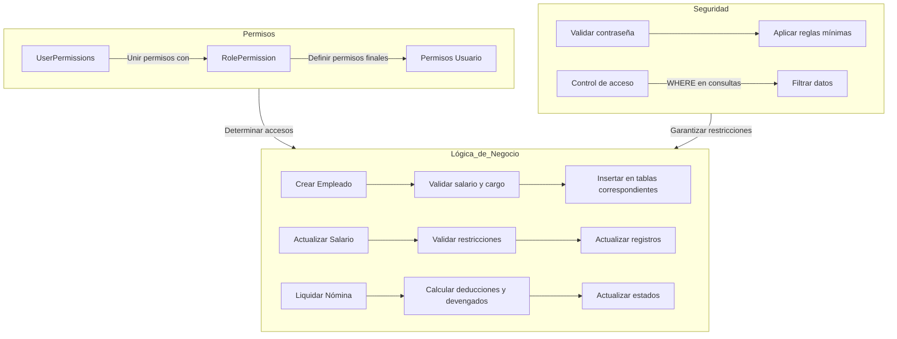
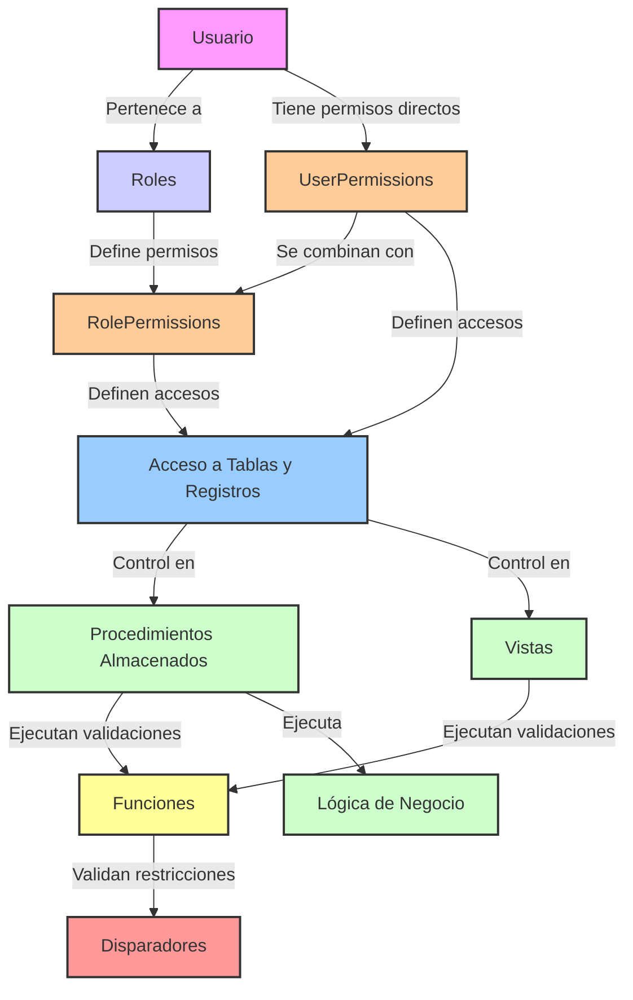

# Arquitectura de lógica de permisos y negocios

flujo de la lógica para permisos

El enfoque general es:
1. **Permisos a nivel de tabla**: se consultan en `UserPermissions` y `RolePermissions`
2. **Permisos a nivel de registro**: se aplican en consultas `WHERE` filtrando por `Username`
3. **Ejecución de procedimientos, funciones y vistas:** se validan los permisos antes de realizar las acciones