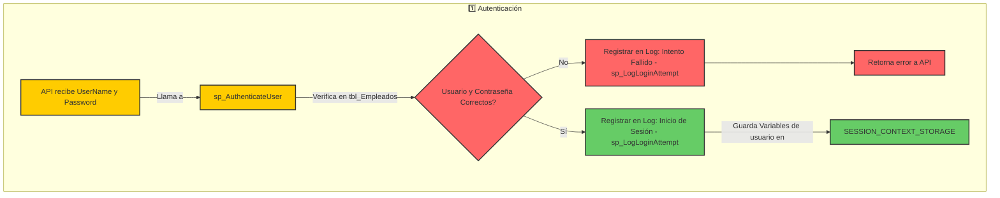

## Autenticación




### Procedimientos

#### sp_AuthenticateUser

Valida usuario y contraseña, usa `SESSION_CONTEXT()`.

Puede devolver los siguientes estados:

| @StattusCode | @Message              | Descripción                                               |
| ------------ | --------------------- | --------------------------------------------------------- |
| 201          | Usuario no encontrado | El `Username` no existe en el sistema (valor por defecto) |
| 202          | Contraseña incorrecta | El usuario existe pero el `password` no es el correcto    |
| 203          | Autenticación Exitosa | El usuario fue logeado y se registro su sesión            |

Registra las siguientes variables de sesión si la respuesta es 2:

| Nombre        | Descipcion                       |
| ------------- | -------------------------------- |
| Username      | Nombre de usuario                |
| UserId        | Id del usuario / Empleado        |
| UserRole      | Id del rol de usuario            |
| UserDeparment | Departamento / área del empleado |
| UserPosition  | Cargo del empleado               |
```sql
-- Procedimiento para Autenticar Usuario

CREATE OR ALTER PROCEDURE sp_AuthenticateUser
    @UsernameInput VARCHAR(50),
    @PasswordInput VARCHAR(255),
    @StatusCode INT OUTPUT,
    @Message NVARCHAR(255) OUTPUT
AS
BEGIN
    SET NOCOUNT ON;
    
    -- Declarar variables
	DECLARE @UserId BIGINT;
	DECLARE @UserRole INT;
	DECLARE @UserPosition INT;
	DECLARE @UserDepartment INT;

	DECLARE @StoredPassword VARBINARY(64);
    DECLARE @InputPassword VARBINARY(64);
    

	-- Inicializa valores
	SET @UserId = 0;
    SET @StatusCode = 201;
    SET @Message = 'Usuario no encontrado';
	 
    
    -- Obtener usuario y contraseña encriptada
    SELECT @UserId = EmployeeID, @StoredPassword = EmPassword
    FROM Employees
    WHERE EmUsername = @UsernameInput;


    -- Validar existencia del usuario
    IF @UserId IS NULL OR @UserId = 0
    BEGIN
        EXEC sp_LogLoginAttempt @UserId = 0, @Username = @UsernameInput, @Status = 0;
        RETURN; 
    END

    -- Generar hash de la contraseña ingresada
    SET @InputPassword = HASHBYTES('SHA2_256', @PasswordInput);

	/*
	Validar valores comparacion
	SELECT 
		'StoredPassword' AS Variable, 
		CONVERT(VARCHAR(128), FORMATMESSAGE('%x', @StoredPassword)) AS HexValue
	UNION ALL
	SELECT 
		'InputPassword', 
		CONVERT(VARCHAR(128), FORMATMESSAGE('%x', @InputPassword));
	*/

	/*
	Ver el tipo de dato
	SELECT 
		SQL_VARIANT_PROPERTY(@StoredPassword, 'BaseType') AS StoredPasswordType,
		SQL_VARIANT_PROPERTY(@InputPassword, 'BaseType') AS InputPasswordType;
	*/


    -- Validar contraseña
	IF @StoredPassword <> @InputPassword
    BEGIN
        EXEC sp_LogLoginAttempt @UserId = @UserId, @Username = @UsernameInput, @Status = 0;
        SET @StatusCode = 202;
        SET @Message = 'Contraseña incorrecta';
        RETURN;
    END

	-- Registrar intento exitoso
    EXEC sp_LogLoginAttempt @UserId = @UserId, @Username = @UsernameInput, @Status = 1;

  
     -- Obtener rol, departamento y cargo del usuario autenticado
    
	SELECT
		@UserRole = em.EmUserRoleId,
		@UserPosition= ep.EpPositionId,
		@UserDepartment = po.PoDepartmentID
	FROM Employees em
	LEFT JOIN EmployeePosition ep ON em.EmployeeId = ep.EpEmployeeId
	LEFT JOIN Positions po ON ep.EpPositionId = po.PositionId
	WHERE ep.EpState = 1 and em.EmployeeId = @UserId;

    -- Almacenar datos en SESSION_CONTEXT
    EXEC sp_set_session_context 'UserId', @UserId;
    EXEC sp_set_session_context 'Username', @UsernameInput;
    EXEC sp_set_session_context 'UserRole', @UserRole;
    EXEC sp_set_session_context 'UserDepartment', @UserDepartment;
    EXEC sp_set_session_context 'UserPosition', @UserPosition;

    -- Éxito
    SET @StatusCode = 203;
    SET @Message = 'Autenticación exitosa';

END;
GO

```
#### sp_LogLoginAttempt
 
 Ver [Controles de Log]
