## Logs - Auditoria

```mermaid
graph TD;
	
	subgraph "3 - Acciones"    
        D[Cualquier accion] -->|Desencadena| E[sp_LogAction]
        E -->|Guarda acción en| F[LogActions]
    end
    
    subgraph "2 - Ejecución de Acciones"    
        O[Cualquier acción en BD] -->|Desencadena| P[trg_LogSQLStatements_Tabla]
        P -->|Guarda sentencia SQL en| Q[tbl_LogSQL]
    end

	subgraph "1 - Intento de Log"    
        A[sp_AuthenticateUser - Ver Autenticación] -->|Desencadena| B[sp_LogLoginAttempt]
        B -->|Guarda intento en| C[LogLogins]
    end
    
	

	style A fill:#ffcc00,stroke:#333,stroke-width:2px;
    style B fill:#ffcc00,stroke:#333,stroke-width:2px;
    style C fill:#ffcc00,stroke:#333,stroke-width:2px;
    style D fill:#66cc66,stroke:#333,stroke-width:2px;
    style E fill:#66cc66,stroke:#333,stroke-width:2px;
    style F fill:#66cc66,stroke:#333,stroke-width:2px;
    style O fill:#cc99ff,stroke:#333,stroke-width:2px;
    style P fill:#cc99ff,stroke:#333,stroke-width:2px;
    style Q fill:#cc99ff,stroke:#333,stroke-width:2px;

```




### Disparadores

#### trg_LogSQLStatements_Table*

Captura sentencias ejecutadas en SQL Server. Se cuenta con un disparador por cada tabla excepto las tablas de logs. Su forma general es la siguiente.

```sql
-- Disparador para Registrar Sentencias Ejecutadas
CREATE OR ALTER TRIGGER trg_LogSQLStatements_<tabla>
ON <tabla> 
AFTER INSERT, UPDATE, DELETE
AS
BEGIN
    SET NOCOUNT ON;

    -- Obtener información del usuario
    DECLARE @UserId BIGINT = ISNULL(CONVERT(BIGINT, SESSION_CONTEXT(N'UserId')), 0);
    DECLARE @Username VARCHAR(50) = ISNULL(CONVERT(VARCHAR(50), SESSION_CONTEXT(N'Username')), 'Desconocido');

    -- Nombre de la tabla afectada
    DECLARE @TableName NVARCHAR(200) = '<tabla>';

    -- Obtener la consulta ejecutada (desde `sys.dm_exec_requests`)
    DECLARE @SQLStatement NVARCHAR(MAX) = '';

    SELECT TOP 1 @SQLStatement = TEXT
    FROM sys.dm_exec_requests
    CROSS APPLY sys.dm_exec_sql_text(sql_handle)
    WHERE session_id = @@SPID;

    -- Insertar en la tabla de logs
    INSERT INTO LogSQL (LsUserId, LsUsername, LsDateTime, LsTable, LsSQLStatement)
    VALUES (@UserId, @Username, GETDATE(), @TableName, @SQLStatement);
END;
GO

```


### Funciones


### Procedimientos

#### sp_LogLoginAttempt

Registra intentos de login exitosos y fallidos.

```sql
-- Procedimiento para Registrar Intento de Login
CREATE OR ALTER PROCEDURE sp_LogLoginAttempt
    @UserId BIGINT = 0,
    @Username VARCHAR(50),
    @Status BIT,  -- 1 para éxito, 0 para fallo
    @IP VARCHAR(50) = '0',  -- IP del usuario, por defecto '0'
    @UserAgent VARCHAR(255) = NULL  -- Información del navegador/dispositivo
AS
BEGIN
    SET NOCOUNT ON;

    INSERT INTO LogLogins (LiUserId, LiUsername, LiDateTime, LiSuccess, LiIP, LiUserAgent)
    VALUES (@UserId, @Username, GETDATE(), @Status, @IP, @UserAgent);
END
GO
```

#### sp_LogAction

Registra cada acción ejecutada en la base.

```sql
-- Procedimiento para Registrar Ejecución de Acciones
CREATE OR ALTER PROCEDURE sp_LogAction
    @ActionTypeId BIGINT,          -- Tipo de acción (ejemplo: LOGIN, CONSULTA, INSERCIÓN)
    @Parameters NVARCHAR(200) = '0',  -- Parámetros de la acción (opcional)
    @AdditionalInfo NVARCHAR(MAX) = '0'  -- Información adicional (opcional)
AS
BEGIN
    SET NOCOUNT ON;

	-- Obtener variables de session
	DECLARE @UserId BIGINT = ISNULL(CONVERT(BIGINT, SESSION_CONTEXT(N'UserId')), 0);
    DECLARE @Username VARCHAR(50) = ISNULL(CONVERT(VARCHAR(50), SESSION_CONTEXT(N'Username')), 'Desconocido');

    -- Insertar el registro en la tabla LogActions
    INSERT INTO LogActions (LaUserId, LaUsername, LaDateTime, LaActionTypeId, LaParameters, LaAddInfo)
    VALUES (@UserId, @Username, GETDATE(), @ActionTypeId, @Parameters, @AdditionalInfo);
    
END;
GO
```


