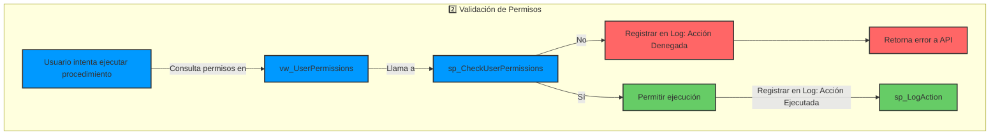

# Permisos

Los permisos se almacenan en las tablas `RolePermissions` (Permisos asignados a un rol) y `UserPermissions`, se pueden presentar los siguientes casos:

- **Solo existen permisos en `RolePermissions`** → El usuario hereda esos permisos.
- **Solo existen permisos en `UserPermissions`** → El usuario usa estos permisos.
- **Tiene permiso en `RolePermissions`, pero en `UserPermissions` está desactivado** → No tiene permiso.
- **No tiene permiso en `RolePermissions`, pero sí en `UserPermissions`** → Tiene permiso.

### Flujo de control de permiso



### Vistas

- **`vw_UserPermissions`** → Unifica permisos de usuarios y roles.
	- Primero, obtenemos los permisos por rol (`RolePermissions`).
	- Luego, obtenemos los permisos por usuario (`UserPermissions`).
	- Después, se combinan ambas consultas, :
	    - Si el usuario tiene **permiso denegado** en `UserPermissions`, no puede acceder.
	    - Si no hay permiso en `RolePermissions`, pero sí en `UserPermissions`, se permite.

```sql
-- Vista para unificar los permisos de los usaurios y ser usada posterior para filtrar por usuario
CREATE VIEW vw_UserPermissions AS
WITH PermissionsBasedRole AS(	
	-- Obtener Permisos de Usuario por ROl
	SELECT 
		e.EmployeeId AS UserId,
		rp.RpTableId AS TableId,
		rp.RpTypeId AS PermissionTypeId,
		rp.RpActive AS AllowedByRole
	FROM Employees e
	INNER JOIN RolePermissions rp ON e.EmUserRoleId = rp.RpRoleId
),
PermmissionsBaseUser AS (
	-- Obtener Permisos de Usuario por Usuario

	SELECT 
		up.UrEmployeeId AS UserId,
		up.UrTableId AS TableId,
		up.UrTypeId AS PermissionTypeId,
		up.UrActive AS AllowedByUser
	FROM UserPermissions up
)

-- Unificar los permisos del usuario
SELECT
	COALESCE(pbr.UserID, pbu.UserID) AS UserId,
    COALESCE(pbr.TableID, pbu.TableID) AS TableId,
	COALESCE(st.TaName, 'Desconocido') AS TableName,
    COALESCE(pbr.PermissionTypeId, pbu.PermissionTypeId) AS PermissionTypeId,
	CASE 
        WHEN pbu.AllowedByUser = 0 THEN 0 -- Si el usuario tiene un permiso denegado, se niega
        WHEN pbr.AllowedByRole = 1 OR pbu.AllowedByUser = 1 THEN 1 -- Si tiene permiso por rol o usuario, se permite
        ELSE 0 -- Si no tiene permisos en ninguna tabla, se niega
    END AS IsAllowed
FROM PermissionsBasedRole pbr 
	FULL OUTER JOIN PermmissionsBaseUser pbu
		ON pbr.UserId = pbu.UserId
		AND	pbr.TableId = pbu.TableId
		AND	pbr.PermissionTypeId = pbu.PermissionTypeId
LEFT JOIN SystemTables st 
	ON COALESCE(pbr.TableId, pbu.TableId) = st.TableId
-- WHERE COALESCE(pbr.UserID, pbu.UserID) = 1;

```
### Funciones

#### sp_CheckUserPermissions

Verifica si un usuario tiene permisos para ejecutar un procedimiento. Se divide en varios procedimientos y funciones para mejorar el mantenimiento y administración de la aplicación:

- **`sp_CheckUserPermissions`**: Controla el flujo principal de validación.
- **`sp_ParseSQLStatement`**: Identifica el tipo de operacion y las tablas afectadas.
- **`sp_HasPermission`**: Consulta `vw_UserPermissions` para verificar si el usuario tiene acceso.


##### sp_CheckUserPermissions

Controla el flujo, y retorna un código o un mensaje según la validación de los datos.

| @StatusCode | @Message                                                                            |
| ----------- | ----------------------------------------------------------------------------------- |
| 301         | Error: No se pudo analizar los permisos para Username                               |
| 302         | Permiso denegado. No tiene acceso a las siguientes tablas: `table1, table2, table3` |
| 303         | Permiso concedido para la operación.                                                |
```sql
CREATE OR ALTER PROCEDURE sp_CheckUserPermissions
(
    @SqlStatement NVARCHAR(MAX), -- Sentencia SQL a ejecutar
    @StatusCode INT OUTPUT,      -- Código de estado
    @Message NVARCHAR(MAX) OUTPUT -- Mensaje de salida
)
AS
BEGIN
    DECLARE @UserId BIGINT;
    DECLARE @OperationTypeId INT;
    DECLARE @AffectedTables NVARCHAR(MAX);
    DECLARE @HasPermission BIT;
    DECLARE @DeniedTables NVARCHAR(MAX);
    DECLARE @ActionDescription NVARCHAR(255);

    -- Obtener el ID del usuario desde la sesión
    SET @UserId = CONVERT(BIGINT, SESSION_CONTEXT(N'UserId'));


    -- 1️ Analizar la consulta SQL para obtener el tipo de operación y las tablas afectadas
    EXEC sp_ParseSQLStatement 
        @SqlStatement = @SqlStatement, 
        @OperationTypeId = @OperationTypeId OUTPUT, 
        @AffectedTables = @AffectedTables OUTPUT;

    -- Si no se pudo determinar el tipo de operación o las tablas, marcar error
    IF @OperationTypeId IS NULL OR @AffectedTables IS NULL
    BEGIN
        SET @StatusCode = 301;
        SET @Message = 'Error: No se pudo analizar los permisos para la sentencia SQL.';

		-- Log PER_No analizo SQL 301
		EXEC sp_LogAction 
			@ActionTypeId = 6, 
			@Parameters = 'sp_CheckUserPermissions', 
			@AdditionalInfo = @SqlStatement;

        RETURN;
    END;

    -- 2️ Validar permisos para la operación y las tablas afectadas
    EXEC sp_HasPermission 
        @AffectedTables = @AffectedTables, 
        @OperationTypeId = @OperationTypeId, 
        @HasPermission = @HasPermission OUTPUT, 
        @DeniedTables = @DeniedTables OUTPUT;

    -- 3️ Manejo de respuesta según permisos
    IF @HasPermission = 1
    BEGIN
        -- Acción permitida
        SET @StatusCode = 303;
        SET @Message = 'Permiso concedido para la operación.';

		-- Log PER_PERMISO OK 303
		EXEC sp_LogAction 
			@ActionTypeId = 5, 
			@Parameters = @OperationTypeId, 
			@AdditionalInfo = @SqlStatement;
	
    END
    ELSE
    BEGIN
        -- Acción denegada
        SET @StatusCode = 302;
        SET @Message = 'Permiso denegado. No tiene acceso a las siguientes tablas: ' + @DeniedTables;

		-- Log PROD_Sin Permisos 302
		EXEC sp_LogAction 
			@ActionTypeId = 8, 
			@Parameters = 'Sin Acceso', 
			@AdditionalInfo = '@DeniedTables';
    END;

END;
GO

```
##### sp_ParseSQLStatement

Identifica el tipo de operación y las tablas que afecta la sentencia SQL a ejecutar.

Retorna:
- @OperationTypeId INt - Id del tipo de permiso, puede ser NULL.
- @AffectedTables VARCHAR - Listado de tablas separado por comas, puede devolver NULL si @OperationTypeId también lo es.

```sql
CREATE OR ALTER PROCEDURE sp_ParseSQLStatement
    @SqlStatement NVARCHAR(MAX),
    @OperationTypeId INT OUTPUT,
    @AffectedTables NVARCHAR(MAX) OUTPUT
AS
BEGIN
    DECLARE @OperationType NVARCHAR(50);
    DECLARE @TableName NVARCHAR(255);
    DECLARE @TableList NVARCHAR(MAX) = '';
    DECLARE @Cursor CURSOR;
	DECLARE @ObjectName NVARCHAR(255);
	DECLARE @Tables TABLE (TableName NVARCHAR(255));

    -- 1 Identificar el tipo de operación SQL
    SET @OperationType = 
        CASE 
            WHEN @SqlStatement LIKE 'SELECT%' THEN 'SELECT'
            WHEN @SqlStatement LIKE 'INSERT%' THEN 'INSERT'
            WHEN @SqlStatement LIKE 'UPDATE%' THEN 'UPDATE'
            WHEN @SqlStatement LIKE 'DELETE%' THEN 'DELETE'
            ELSE NULL
        END;

    -- 2 Obtener el ID del permiso desde PermissionsType
    SELECT @OperationTypeId = PermissionTypeId 
    FROM PermissionsType 
    WHERE PtName = @OperationType;

    -- Si no hay operación válida, retornar NULL
    IF @OperationTypeId IS NULL
    BEGIN
        SET @AffectedTables = NULL;
        RETURN;
    END

    -- 3 Recorrer las tablas afectadas en la consulta SQL - DIRECTAS
    SET @Cursor = CURSOR FOR
    SELECT name 
    FROM sys.tables 
    WHERE CHARINDEX(name, @SqlStatement) > 0; -- Buscar si la tabla está en la consulta

    OPEN @Cursor;
    FETCH NEXT FROM @Cursor INTO @TableName;

    WHILE @@FETCH_STATUS = 0
    BEGIN
        -- Construir lista de tablas separadas por comas
        SET @TableList = @TableList + @TableName + ',';
        FETCH NEXT FROM @Cursor INTO @TableName;
    END

    CLOSE @Cursor;
    DEALLOCATE @Cursor;

	-- 4️ Identificar si se están llamando vistas
    SET @Cursor = CURSOR FOR
    SELECT name 
    FROM sys.objects 
    WHERE (type IN ('V'))  -- Vistas
    AND CHARINDEX(name, @SqlStatement) > 0; -- Buscar si el objeto está en la consulta

    OPEN @Cursor;
    FETCH NEXT FROM @Cursor INTO @ObjectName;

    WHILE @@FETCH_STATUS = 0
    BEGIN
        -- Buscar todas las tablas que dependen del objeto
        INSERT INTO @Tables (TableName)
        SELECT DISTINCT referenced_entity_name 
        FROM sys.dm_sql_referenced_entities(@ObjectName, 'OBJECT') 
        WHERE referenced_minor_id = 0; -- Solo entidades principales, no columnas

        FETCH NEXT FROM @Cursor INTO @ObjectName;
    END

    CLOSE @Cursor;
    DEALLOCATE @Cursor;


    -- Remover la última coma
    IF LEN(@TableList) > 0
        SET @AffectedTables = LEFT(@TableList, LEN(@TableList) - 1);
    ELSE
        SET @AffectedTables = NULL;
END;
GO
```

##### sp_HasPermission

Retorna:
- ***@HasPermission*** 1 Si tiene permisos en todas las tablas
- ***@HasPermission*** 0 Si en en algunas de las tablas no tiene permisos, y un listado de las tablas sin permiso ***@DeniedTables***.

```sql
CREATE OR ALTER PROCEDURE sp_HasPermission 
(
    @AffectedTables NVARCHAR(MAX), -- Lista de tablas separadas por comas
    @OperationTypeId INT,
    @HasPermission BIT OUTPUT,
    @DeniedTables NVARCHAR(MAX) OUTPUT
)
AS
BEGIN
    DECLARE @UserId BIGINT;
    DECLARE @TableName NVARCHAR(255);

    -- Obtener el ID del usuario desde la sesión
    SET @UserId = CONVERT(BIGINT, SESSION_CONTEXT(N'UserId'));

    -- Validar que se haya obtenido un usuario válido
    IF @UserId IS NULL
    BEGIN
        SET @HasPermission = 0;
        SET @DeniedTables = 'No se pudo obtener el usuario de la sesión.';
        RETURN;
    END;

    -- Inicializar valores
    SET @HasPermission = 1; -- Asumimos que tiene permiso hasta que se pruebe lo contrario
    SET @DeniedTables = '';

    -- Cursor para recorrer cada tabla afectada
    DECLARE cur_Tables CURSOR FOR
    SELECT value FROM STRING_SPLIT(@AffectedTables, ',');

    OPEN cur_Tables;
    FETCH NEXT FROM cur_Tables INTO @TableName;

    WHILE @@FETCH_STATUS = 0
    BEGIN
        -- Verificar si el usuario tiene permiso en esta tabla
        IF NOT EXISTS (
            SELECT 1 
            FROM vw_UserPermissions 
            WHERE UserId = @UserId 
            AND TableName = @TableName 
            AND PermissionTypeId = @OperationTypeId
            AND IsAllowed = 1
        )
        BEGIN
            -- Marcar que el usuario no tiene permiso
            SET @HasPermission = 0;

            -- Agregar la tabla a la lista de tablas denegadas
            SET @DeniedTables = 
                CASE 
                    WHEN @DeniedTables = '' THEN @TableName 
                    ELSE @DeniedTables + ',' + @TableName 
                END;
        END

        FETCH NEXT FROM cur_Tables INTO @TableName;
    END

    CLOSE cur_Tables;
    DEALLOCATE cur_Tables;
END;
GO
```
