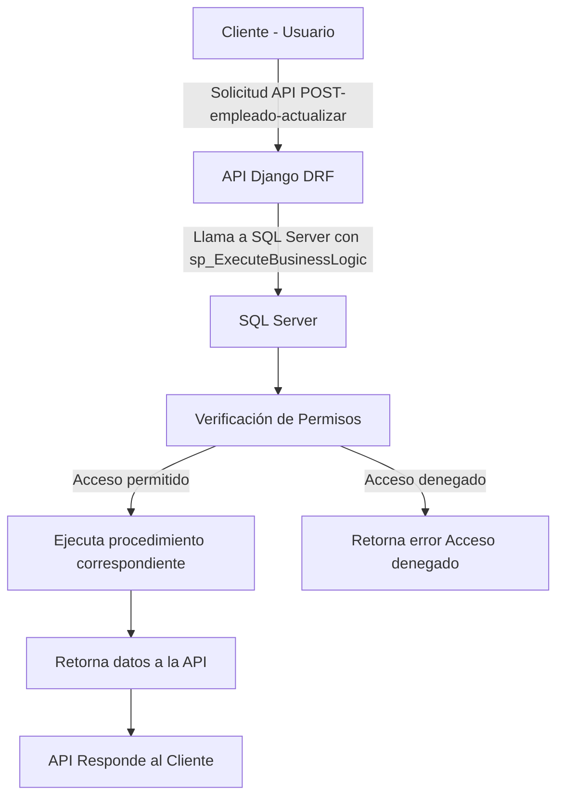

# Procedimiento Orquestador

El procedimiento `sp_ExecuteBusinessLogic` es el punto de entrada para la ejecución de la lógica de negocio en SQL Server. Recibe una solicitud desde la API, verifica la autenticación y los permisos del usuario, y luego ejecuta dinámicamente el procedimiento específico asociado a la acción solicitada.

Se encarga de:  

- Validar que el usuario esté autenticado.  
- Comprobar los permisos del usuario sobre la acción solicitada.  
- Ejecutar el procedimiento correspondiente si los permisos son válidos.  
- Retornar el resultado de la operación o un mensaje de error si no tiene permisos.


## Parámetros de Entrada

| Parámetro        | Tipo de Dato    | Descripción                                                                                   |
| ---------------- | --------------- | --------------------------------------------------------------------------------------------- |
| `@UserName`      | `NVARCHAR(100)` | Nombre de usuario autenticado en la API.                                                      |
| `@ProcedureName` | `NVARCHAR(255)` | Nombre del procedimiento almacenado a ejecutar.                                               |
| `@Params`        | `NVARCHAR(MAX)` | Parámetros en formato JSON o XML con los valores necesarios para el procedimiento solicitado. |

## Parámetros de Salida

| Parámetro     | Tipo de Dato    | Descripción                                                                 |
| ------------- | --------------- | --------------------------------------------------------------------------- |
| `@StatusCode` | `INT`           | Código de estado (1=Éxito, 0=Error, 2=Permiso denegado).                    |
| `@Message`    | `NVARCHAR(MAX)` | Mensaje de respuesta con detalles del resultado.                            |
| `@ResuldData` | `NVARCHAR(MAX)` | Datos resultantes de la operación (ID Insertado, registros consulta, etc..) |

## Uso

```sql
DECLARE @StatusCode INT, @Message NVARCHAR(MAX), @ResultData NVARCHAR(MAX);

EXEC sp_ExecuteBusinessLogic 
    @UserName = 'jdoe', 
    @ProcedureName = 'sp_UpdateEmployeeSalary', 
    @Params = '{"EmployeeId": 101, "NewSalary": 3500.00}',
    @StatusCode = @StatusCode OUTPUT,
    @Message = @Message OUTPUT,
    @ResultData = @ResultData OUTPUT;

SELECT @StatusCode AS StatusCode, @Message AS Message, @ResultData AS ResultData;

```


```sql
CREATE OR ALTER PROCEDURE sp_ExecuteBusinessLogic
    @UserName VARCHAR(100),
	@Password VARCHAR(255),
    @ProcedureName NVARCHAR(255), -- Procedimiento
    @Params NVARCHAR(MAX) = NULL,
    @StatusCode INT OUTPUT,
    @Message NVARCHAR(MAX) OUTPUT,
    @ResultData NVARCHAR(MAX) OUTPUT
AS
BEGIN
    SET NOCOUNT ON;
    
    DECLARE @UserId INT;
    DECLARE @HasPermission BIT;
    DECLARE @SQL NVARCHAR(MAX);
    DECLARE @ParamDefinition NVARCHAR(MAX);
	DECLARE @StatusCodeUsr INT;
	DECLARE @MessageUsr NVARCHAR(255);
	DECLARE @JsonResponseProd NVARCHAR(MAX);
	DECLARE @ParamsProd NVARCHAR(200);

	DECLARE @SessionUserId BIGINT;
	DECLARE @SessionUsername NVARCHAR(50);

	SET @ParamsProd = @Params;

	-- Autentica el Usuario
	EXEC sp_AuthenticateUser 
		@UsernameInput = @UserName, 
		@PasswordInput = @Password,
		@StatusCode = @StatusCodeUsr OUTPUT, 
		@Message = @MessageUsr OUTPUT;

	IF @StatusCodeUsr <> 203
	BEGIN
		SET @StatusCode = @StatusCodeUsr;
		SET @Message = @MessageUsr;
		RETURN;
	END
	

	-- LOGIN CORRECTO
	-- ---------------------------------------------------------

	SELECT 
		@SessionUserId = CAST(SESSION_CONTEXT(N'UserId') AS BIGINT),
		@SessionUsername = CAST(SESSION_CONTEXT(N'Username') AS NVARCHAR(50));
	
	-- Log PROC_INICIADO
	EXEC sp_LogAction 
		@ActionTypeId = 1, 
		@Parameters = @ProcedureName, 
		@AdditionalInfo = @Params;

	-- Verificar si existe el procedimiento
	-- ----------------------------------------------------

	IF NOT EXISTS (SELECT 1 FROM sys.procedures WHERE name = @ProcedureName)
	BEGIN
		SET @StatusCode = 901;
		SET @Message = 'El procedimiento no existe';
		
		-- Log PROC_NO_EXISTE
		EXEC sp_LogAction 
			@ActionTypeId = 2, 
			@Parameters = @ProcedureName, 
			@AdditionalInfo = @Params;
		
		RETURN
	END

	-- Ejecutar el procedimiento
	-- ----------------------------------------------------
	EXEC sp_GetUserPermissions_JSON 
		@Params = @ParamsProd,
		@JsonResponse = @JsonResponseProd OUTPUT,
		@StatusCode = @StatusCode OUTPUT,
		@Message = @Message OUTPUT;

		

		SET @StatusCode = @StatusCode;
		SET @Message = @Message;
		SET @ResultData = @JsonResponseProd;


END;

```