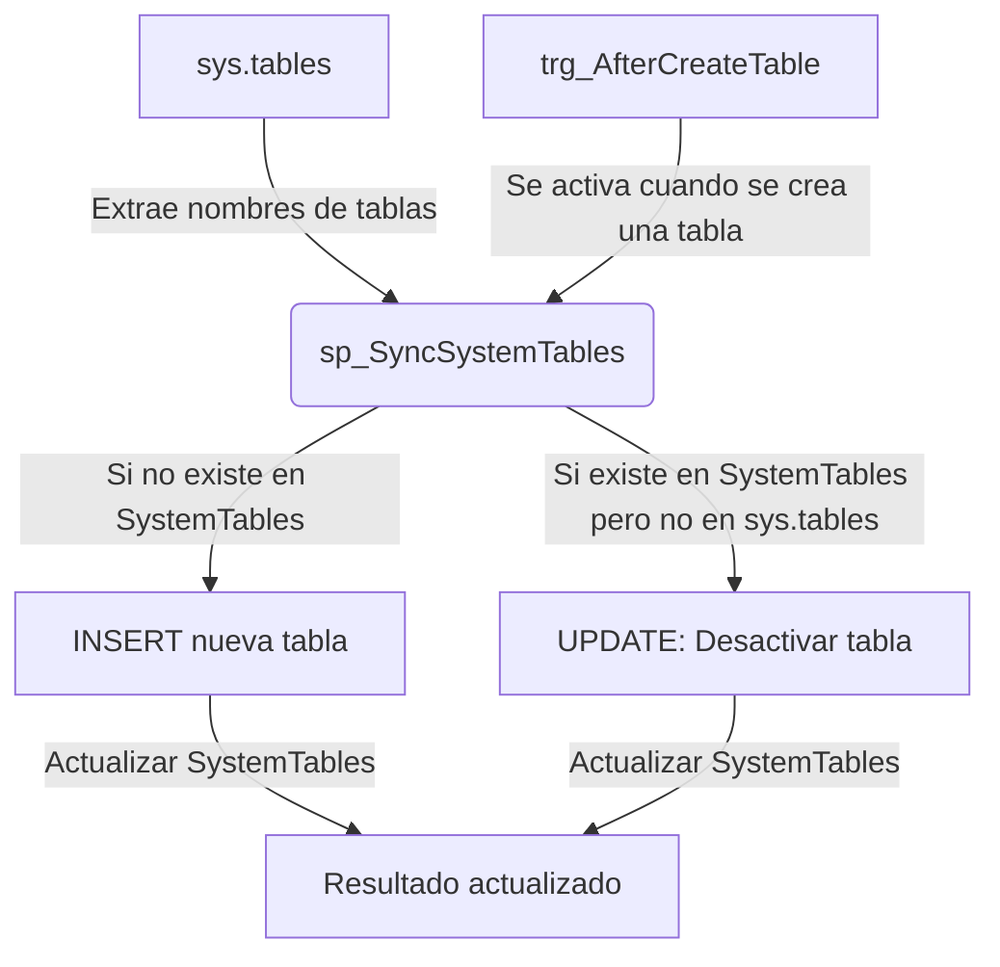

## Poblar tabla SystemTables



**`sp_SyncSystemTables`**
	- Agrega nuevas tablas que no estén registradas.
	- Desactiva las tablas que fueron eliminadas.
**`trg_AfterCreateTable`**
	- Se activa automáticamente cuando se crea una nueva tabla.
	- Ejecuta `sp_SyncSystemTables` para mantener la sincronización.

```sql
-- Procedimiento para sincronizar las tablas del sistema
CREATE PROCEDURE sp_SyncSystemTables
AS
BEGIN
    SET NOCOUNT ON;

    -- Insertar nuevas tablas que no estén en SystemTables
    INSERT INTO SystemTables (TaName, TaActive)
    SELECT t.name, 1
    FROM sys.tables AS t
    WHERE NOT EXISTS (
        SELECT 1 FROM SystemTables st WHERE st.TaName = t.name
    );

    -- Desactivar tablas eliminadas
    UPDATE SystemTables
    SET TaActive = 0
    WHERE TaName NOT IN (SELECT name FROM sys.tables);
END;

-- Disparador para sincronizar SystemTables cuando se crea una nueva tabla
CREATE TRIGGER trg_AfterCreateTable
ON DATABASE
FOR CREATE_TABLE
AS
BEGIN
    EXEC sp_SyncSystemTables;
END;

-- Disparador para sincronizar SystemTables cuando se elimina una tabla
CREATE TRIGGER trg_DisableTableSystemTables
ON DATABASE
FOR DROP_TABLE
AS
BEGIN
    SET NOCOUNT ON;

    DECLARE @TableName NVARCHAR(255);

    -- Obtener el nombre de la tabla eliminada desde EVENTDATA()
    SET @TableName = (SELECT EVENTDATA().value('(/EVENT_INSTANCE/ObjectName)[1]', 'NVARCHAR(255)'));

    -- Actualizar el registro en SystemTables, desactivando la tabla eliminada
    UPDATE SystemTables
    SET TaActive = 0
    WHERE TaName = @TableName;

    PRINT 'Tabla desactivada en SystemTables: ' + @TableName;
END;
GO


```

Para sincronización manual:

```sql
EXEC sp_SyncSystemTables;
```
